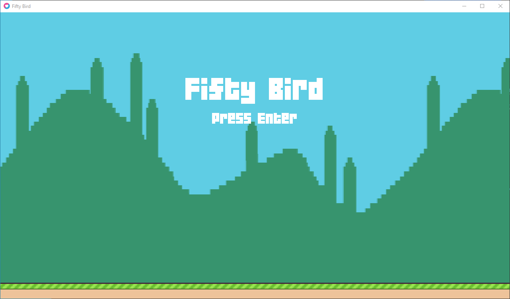
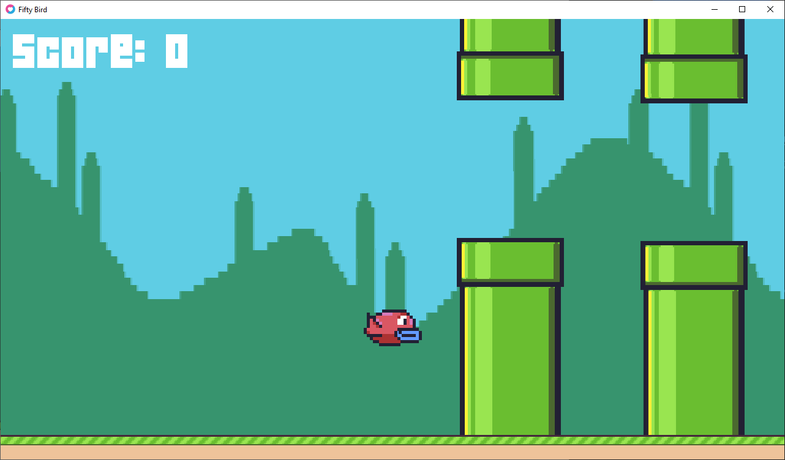

# fifty bird
### Games50's "fifty bird"

<br>

CS50's Introduction to Game Development 2018 [playlist link](https://www.youtube.com/playlist?list=PLhQjrBD2T383Vx9-4vJYFsJbvZ_D17Qzh)

Flappy Bird - Lecture 1 [youtube video link](https://www.youtube.com/watch?v=3IdOCxHGMIo)

<br>

## Setup

Download and install LÖVE2D from [https://love2d.org/](https://love2d.org/).

Then add it to path to access it any where within terminal.

To run LÖVE2D application run the following command from terminal.

```powershell
$ love <folder where main.lua of LÖVE2D application>
```

Or if `main.lua` file is in current directory, then

```powershell
$ cd <to directory containing main.lua>
$ love .
```

<br>

final output:



